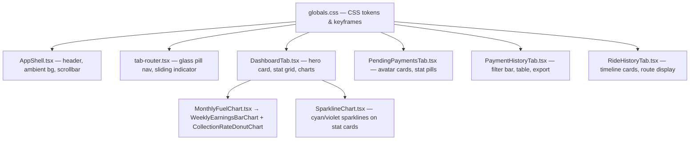
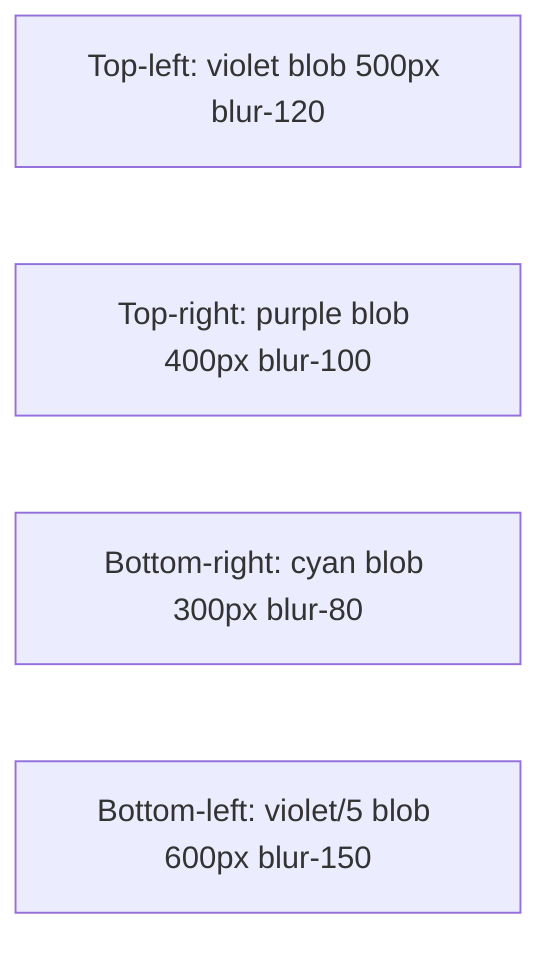
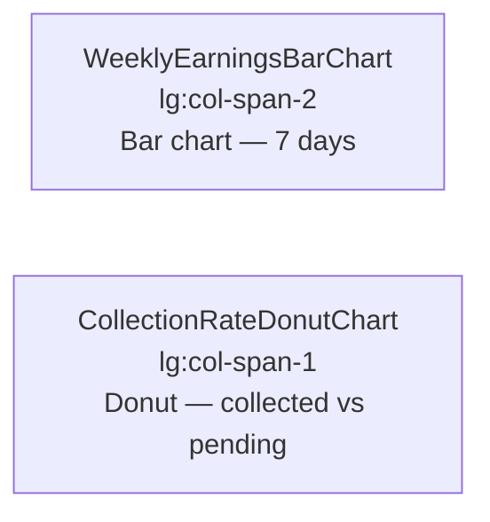
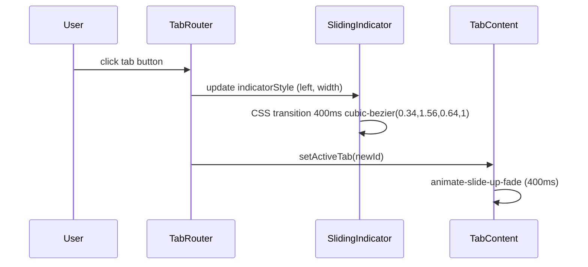
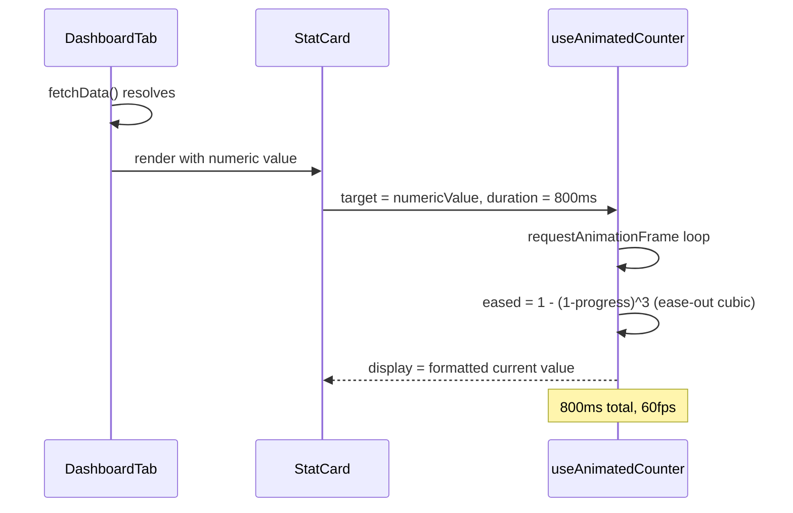
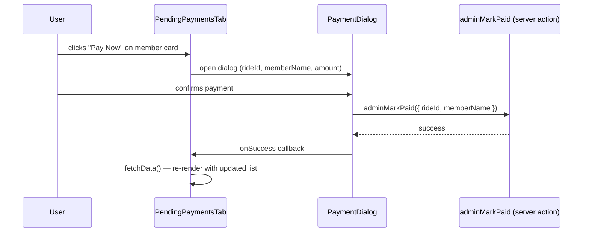

# Design Document: Premium UI/UX Redesign for MITE Ride Manager

## Overview

This document covers the complete visual and interaction redesign of the MITE Ride Manager web app into a premium, glassmorphism-meets-minimal dark SaaS interface. The app is a carpooling expense tracker for a college group commuting daily to MITE, built on Next.js 16 App Router, React 19, TypeScript, Tailwind CSS v4, and Recharts — no new npm packages will be added.

The redesign shifts the existing indigo-primary design system to an electric violet + cyan dual-accent palette on a near-black base, elevates every surface to true glassmorphism cards with backdrop blur, replaces static UI elements with meaningful micro-animations, and upgrades each tab's information architecture to match the premium SaaS spec described below.

---

## Architecture

The redesign is **purely presentational** — no server actions, Prisma schema, data shapes, or TypeScript interfaces change. All mutations happen through the existing CSS token layer and component JSX only.



**Constraint surface:** Only the files listed above are modified. Server actions, Prisma client, lib utilities, and route handlers remain untouched.

---

## Design Token Delta

The following CSS custom properties in `globals.css` must be updated under the `.dark` rule (and `:root` where applicable):

| Token | Current | Target | Usage |
|---|---|---|---|
| `--background` | `#0A0A0F` | `#08090d` | Page background |
| `--card` | `#12121A` | `#0f1117` | Default card surface |
| `--surface-2` | `#1A1A24` | `#161922` | Secondary card surface |
| `--primary` | `#6366F1` (indigo) | `#7c3aed` (electric violet) | CTAs, active states, indicators |
| `--primary-glow` | `#A855F7` | `#6d28d9` (purple) | Glow shadows |
| `--border` | `rgba(255,255,255,0.06)` | `rgba(255,255,255,0.08)` | Card borders |
| `--cyan` *(new)* | — | `#06b6d4` | Amounts, sparklines, data highlights |

### Glass Utility Class Updates

The `.glass`, `.glass-strong`, `.glass-premium` classes in `globals.css` must be updated to match the new spec:

```css
/* Target values */
.glass-premium {
  background: rgba(255, 255, 255, 0.04);
  backdrop-filter: blur(20px);
  -webkit-backdrop-filter: blur(20px);
  border: 1px solid rgba(255, 255, 255, 0.08);
  box-shadow: 0 8px 32px rgba(0,0,0,0.4), inset 0 1px 1px rgba(255,255,255,0.06);
}
```

### Scrollbar

```css
::-webkit-scrollbar { width: 4px; height: 4px; }
::-webkit-scrollbar-thumb {
  background: linear-gradient(to bottom, #7c3aed, #6d28d9);
  border-radius: 999px;
}
```

---

## Component Architecture & Interfaces

### 1. `globals.css` — Token & Animation Layer

**Additions required:**
- New `--cyan: #06b6d4` token in both `:root` and `.dark`
- New `@keyframes count-up` for number entrance animation
- New `@keyframes pulse-overdue` for the red overdue dot pulse
- New `@keyframes gradient-shift` for hero card background animation
- Scrollbar update to 4px thin violet

**Interface (CSS API consumed by components):**
```
--color-cyan          → #06b6d4  (amounts, sparklines)
--color-primary       → #7c3aed  (CTAs, active indicator)
.glass-premium        → blur(20px) + rgba(255,255,255,0.04) bg
.animate-count-up     → number entrance animation
.animate-pulse-overdue → pulsing red dot for overdue
```

---

### 2. `AppShell.tsx` — Shell & Ambient Background

**Changes:**
- Ambient glow blobs shift from `primary/10` (indigo) to `#7c3aed/10` (violet) and add a cyan blob at bottom-right
- Header glass uses new token values
- The fixed top gradient accent bar uses `from-[#7c3aed] via-[#6d28d9] to-[#7c3aed]`
- Footer "System Online" indicator style unchanged (success green)

**Ambient blob layout:**



---

### 3. `tab-router.tsx` — Glass Pill Navigation

**Changes:**
- Active tab indicator: `bg-gradient-to-r from-[#7c3aed] to-[#6d28d9]` with `box-shadow: 0 0 20px rgba(124,58,237,0.4)`
- Inactive tab icon/label: `text-white/30` → `hover:text-white/60`
- Tab icon for active state: `drop-shadow-[0_0_8px_rgba(124,58,237,0.6)]`
- The outer container `.glass-premium` uses updated token

**Tab icon color map:**

| Tab | Icon | Active glow color |
|---|---|---|
| Dashboard | LayoutDashboard | `rgba(124,58,237,0.6)` — violet |
| Create Ride | PlusCircle | `rgba(16,185,129,0.6)` — emerald (admin) |
| Pending | Clock | `rgba(245,158,11,0.6)` — amber |
| History | History | `rgba(124,58,237,0.6)` — violet |
| Rides | List | `rgba(6,182,212,0.6)` — cyan |
| Settings | Settings | `rgba(100,116,139,0.6)` — slate (admin) |

---

### 4. `DashboardTab.tsx` — Main Dashboard

#### 4a. Hero Vehicle Card

Full-bleed gradient banner with the car image right-aligned and a violet rim-light glow.

```
Structure:
  <div class="hero-card relative overflow-hidden rounded-3xl">
    <!-- Background gradient: #1a0533 → #0a1628 (deep purple to dark navy) -->
    <!-- Left: text content + spec grid (2×2 pill layout) + live fuel badge -->
    <!-- Right: car-hero.png with purple rim-light glow effect -->
    <!-- Subtle scan-line animation overlay -->
  </div>
```

**Live Fuel Price Badge:**
```
<div class="fuel-badge">
  <span class="pulsing-green-dot" />   ← status-dot class with bg-success
  <span>₹{todayPetrolPrice}/L</span>
  <span class="text-muted-foreground text-[10px]">Live</span>
</div>
```

**2×2 Spec Grid (inside frosted panel):**
| | Left | Right |
|---|---|---|
| Row 1 | Active Mileage (km/L) | Route Distance (km) |
| Row 2 | Fuel Required (L) | Est. Trip Cost (₹ in violet) |

**Rim-light glow on car image:**
```css
/* Applied as box-shadow on the image container */
box-shadow: 
  0 0 60px rgba(124, 58, 237, 0.3),
  0 0 120px rgba(109, 40, 217, 0.15),
  inset 0 0 40px rgba(124, 58, 237, 0.05);
```

#### 4b. Stats Row — 4 Metric Cards

Exactly 4 cards (reduced from 8) in glassmorphism style. Each card:

```
StatCard structure:
  ┌─────────────────────────────────────────────┐
  │  [Colored Icon Square 44×44px]              │
  │  [Animated counter — 36–40px 300 weight]    │
  │  [Label — 11px uppercase tracking-widest]   │
  │  [Trend badge — green/red pill + arrow]      │
  │  [Sparkline — 32px height, recharts/SVG]     │
  └─────────────────────────────────────────────┘
```

**4 cards and their accent colors:**

| # | Title | Icon Square | Sparkline Color | Trend |
|---|---|---|---|---|
| 1 | Today's Fuel Cost | Violet `#7c3aed` | `#7c3aed` | vs yesterday |
| 2 | Total Pending | Amber `#f59e0b` | `#f59e0b` | vs last week |
| 3 | Total Collected | Cyan `#06b6d4` | `#06b6d4` | vs last week |
| 4 | Collection Rate | Green `#10b981` | `#10b981` | vs last week |

Hover: `translateY(-2px)` + `box-shadow: 0 0 20px rgba(124,58,237,0.15)`
Numbers: `font-size: 36–40px`, `font-weight: 300`, count-up animation on load.
Labels: `font-size: 11px`, `text-transform: uppercase`, `letter-spacing: 0.1em`.

**Trend badge:**
```tsx
<span className={`inline-flex items-center gap-1 rounded-full px-2 py-0.5 text-[10px] font-semibold
  ${positive ? 'bg-success/15 text-success' : 'bg-destructive/15 text-destructive'}`}>
  {positive ? <ArrowUpRight className="h-3 w-3" /> : <ArrowDownRight className="h-3 w-3" />}
  {Math.abs(delta)}%
</span>
```

#### 4c. Charts Row

Two charts side-by-side (replaces the area chart + quick stats column):



**WeeklyEarningsBarChart** (new component or refactor of `MonthlyFuelChart.tsx`):
- Recharts `BarChart` with `Bar` component
- X-axis: last 7 days (Mon–Sun short labels)
- Y-axis: ₹ amounts
- Bar fill: `fill="url(#violetBarGradient)"` (violet → purple gradient)
- Tooltip: existing glass-styled `CustomTooltip` pattern
- Responsive via `ResponsiveContainer`

**CollectionRateDonutChart** (new component in `components/charts/`):
- Recharts `PieChart` with `Pie` (inner radius 60, outer radius 90 — donut shape)
- Two segments: `collected` (cyan `#06b6d4`) and `pending` (amber `#f59e0b`)
- Center label: `{rate}%` in large gradient text
- Legend below: "Collected" vs "Pending" pill labels
- No new package — uses existing Recharts `PieChart`, `Pie`, `Cell`, `Tooltip`

---

### 5. `PendingPaymentsTab.tsx` — Pending Payments

#### 5a. Summary Stat Pills (top)

3 pill-style summary cards replacing the circular-progress cards:

```
Pill layout (each):
  ┌────────────────────────────────────────┐
  │  [Icon]  [Big Number]  [Label]         │
  │  subtle gradient border                │
  └────────────────────────────────────────┘
```

| Pill | Accent | Animation |
|---|---|---|
| Pending (count) | Amber `#f59e0b` | none |
| Overdue (count) | Red `#f43f5e` | `animate-pulse` on dot |
| Members (count) | Violet `#7c3aed` | none |

#### 5b. Member List — Avatar Glass Cards

Each payment item renders as a glass card (not a table row):

```tsx
interface MemberCardProps {
  memberName: string;      // e.g. "Shameek"
  initials: string;        // e.g. "SY" — derived from name
  avatarGradient: string;  // deterministic gradient from name hash
  amount: number;
  rideDate: Date;
  status: "PENDING" | "OVERDUE" | "VERIFICATION";
  onPayClick: () => void;
  isAdmin: boolean;
}
```

**Card structure:**
```
┌─────────────────────────────────────────────────────────┐
│  [Avatar Circle]   [Name + Due Date]   [Amount]  [CTA]  │
│  gradient bg       name bold           cyan text  button │
│  initials          date muted          owed              │
│  44×44px           text-sm             stat-number       │
└─────────────────────────────────────────────────────────┘
```

Avatar gradient mapping (deterministic by name, no runtime randomness):
```tsx
const AVATAR_GRADIENTS = [
  "from-violet-500 to-purple-600",
  "from-cyan-500 to-blue-600",
  "from-amber-500 to-orange-600",
  "from-rose-500 to-pink-600",
  "from-emerald-500 to-teal-600",
  "from-indigo-500 to-violet-600",
];
// avatarGradient = AVATAR_GRADIENTS[sum_of_char_codes(name) % AVATAR_GRADIENTS.length]
```

Status badge:
```tsx
const STATUS_STYLES = {
  PAID:         "bg-success/10 text-success border-success/20",
  PENDING:      "bg-warning/10 text-warning border-warning/20",
  OVERDUE:      "bg-destructive/10 text-destructive border-destructive/20",
  VERIFICATION: "bg-[#7c3aed]/10 text-[#7c3aed] border-[#7c3aed]/20",
};
```

"Mark Paid" / "Pay Now" button: `bg-gradient-to-r from-[#7c3aed] to-[#6d28d9]` CTA.
Admin-only "Mark Paid" button remains gated with `isAdmin` prop.

#### 5c. Empty State

```
Animated SVG checkmark (gradient stroke: #7c3aed → #06b6d4)
"All Clear!" in gradient text (violet → cyan)
Sub-label: "Everyone is paid up"
```

The checkmark SVG animation uses CSS `stroke-dasharray` + `stroke-dashoffset` animation (already supported by `@keyframes progress-ring` in globals.css).

---

### 6. `PaymentHistoryTab.tsx` — History

#### 6a. Top 3 Stat Cards

Same glassmorphism card pattern as Dashboard stat cards but static (no sparkline):
- Total Collected (green icon square)
- Avg Payment (violet icon square)  
- Records count (cyan icon square)

#### 6b. Filter Bar

```
[🔍 Search pill] [Member selector dropdown] [Time range dropdown] [CSV button] [JSON button]
```

- All inputs: `rounded-full` pill shape with glass styling (`bg-white/[0.04] border border-white/[0.08]`)
- Export buttons: outlined glass style — `border border-[#7c3aed]/40 text-[#7c3aed] hover:bg-[#7c3aed]/10`
- Member selector: pill-style `<select>` with custom arrow

#### 6c. Table

```
Header: sticky, backdrop-blur-xl, bg-card/90
Rows:   alternating rgba(255,255,255,0.02) on even rows
        hover: rgba(255,255,255,0.04) with left border accent in violet
Amount: text-[#06b6d4] (cyan) + font-semibold
Status: "Paid" badge in success green
Date:   text-muted-foreground
```

#### 6d. Empty State

Animated rising-chart SVG (gradient stroke violet → cyan), "No history yet" in gradient text.

---

### 7. `RideHistoryTab.tsx` — Rides

#### 7a. Timeline Card

Each ride renders as a timeline card:

```
Timeline layout:
  [Date Badge Left]  ─── [Route: FromLocation → ToLocation] ─── [Cost]
       │                  [Passenger chips]                    [violet]
  vertical line
       │
  [Next ride...]
```

**Date badge:**
```tsx
<div className="flex flex-col items-center justify-center rounded-xl bg-[#7c3aed]/10 border border-[#7c3aed]/20 px-3 py-2 min-w-[52px]">
  <span className="text-[10px] text-[#7c3aed] uppercase font-bold tracking-widest">
    {format(date, 'MMM')}
  </span>
  <span className="text-xl font-extrabold text-white leading-none">
    {format(date, 'd')}
  </span>
</div>
```

**Route display** (currently shows just a date; redesign adds From → To):
The `Ride` interface already has `notes` — the route display will derive `From` and `To` from `notes` if available, otherwise fall back to "MITE → Home" as the standard college commute label. No schema change needed.

```tsx
const routeDisplay = {
  from: "Home",  // default
  to: "MITE",   // default
};
// If ride.notes contains "→" separator, parse it
```

**Passenger chips:**
```tsx
{ride.attendees.map(a => (
  <span key={a.id} 
    className="inline-flex items-center gap-1 rounded-full bg-white/[0.06] border border-white/[0.08] px-2.5 py-1 text-[10px] font-medium text-white/70">
    {a.member.name.split(' ')[0]}  {/* first name only */}
  </span>
))}
```

**Cost display:**
```tsx
<div className="text-right">
  <p className="text-xs text-muted-foreground">per person</p>
  <p className="text-base font-bold text-[#06b6d4]">
    {formatCurrency(ride.totalCost / ride.attendees.length)}
  </p>
  <p className="text-[10px] text-muted-foreground">
    total {formatCurrency(ride.totalCost)} <span className="text-[#7c3aed] font-semibold">●</span>
  </p>
</div>
```

#### 7b. Empty State

```
Calendar SVG with gradient stroke (violet → cyan)
"No rides yet" in gradient text  
"Create First Ride" CTA button (violet gradient, admin-gated)
```

---

## Sequence Diagrams — Key Interaction Flows

### Tab Switching Animation



### Number Count-Up on Dashboard Load



### Pending Tab — Mark Paid Flow (unchanged logic, updated UI)



---

## Data Models

No data model changes. The redesign consumes existing shapes:

```typescript
// Unchanged — from stats.actions.ts
interface DashboardData {
  totalPending: number;
  totalCollected: number;
  totalFuelCost: number;
  totalRides: number;
  pendingCount: number;
  paidCount: number;
  overdueCount: number;
  monthlyFuelSpend: Array<{ month: string; amount: number }>;
  averageCostPerRide: number;
  averageCostPerPerson: number;
  mostFrequentDefaulter: { name: string; count: number } | null;
  todayPetrolPrice: number;
  todayFuelCost: number;
  memberAttendance: Record<string, { attended: number; totalSpent: number }>;
  mileage: number;
  routeDistance: number;
}

// Unchanged — used by PendingPaymentsTab
interface PendingItem {
  rideId: string;
  memberName: string;
  amount: number;
  rideDate: Date;
  status: string;
  createdAt: Date;
}
```

**New derived data** (computed client-side, no server changes):
```typescript
// Computed from DashboardData for the 4-card stat row
const collectionRate = totalCollected / (totalPending + totalCollected) * 100;

// Computed for WeeklyEarningsBarChart
// Source: monthlyFuelSpend filtered to last 7 days
// Since server returns monthly data, the bar chart will show last 6 months
// (same data, different chart type — BarChart instead of AreaChart)

// Computed for CollectionRateDonutChart
const donutData = [
  { name: "Collected", value: totalCollected, color: "#06b6d4" },
  { name: "Pending",   value: totalPending,   color: "#f59e0b" },
];

// Computed for member avatar initials
const getInitials = (name: string): string =>
  name.split(' ').map(n => n[0]).join('').toUpperCase().slice(0, 2);

// Computed for avatar gradient (deterministic, stable across renders)
const getAvatarGradient = (name: string): string => {
  const sum = name.split('').reduce((acc, c) => acc + c.charCodeAt(0), 0);
  return AVATAR_GRADIENTS[sum % AVATAR_GRADIENTS.length];
};
```

---

## New Components

### `components/charts/WeeklyEarningsBarChart.tsx`

Replaces (or refactors) `MonthlyFuelChart.tsx` from AreaChart to BarChart:

```typescript
interface WeeklyEarningsBarChartProps {
  data: Array<{ month: string; amount: number }>;
}
// Uses: BarChart, Bar, XAxis, YAxis, CartesianGrid, Tooltip, ResponsiveContainer from recharts
// Bar fill: linearGradient from #7c3aed to #6d28d9 (defined in <defs>)
```

### `components/charts/CollectionRateDonutChart.tsx`

New component:

```typescript
interface CollectionRateDonutChartProps {
  collected: number;
  pending: number;
}
// Uses: PieChart, Pie, Cell, Tooltip, ResponsiveContainer from recharts
// Inner radius: 55, Outer radius: 85
// Colors: cyan (#06b6d4) for collected, amber (#f59e0b) for pending
// Center text: collection rate % rendered as SVG text via customized label
```

---

## Error Handling

| Scenario | Current Behavior | Redesign Behavior |
|---|---|---|
| Data fetch fails | Spinner stays, no message | Same — loading skeleton shown, no API changes |
| Empty pending list | Green empty state with CheckCircle icon | Animated SVG checkmark + gradient "All Clear!" |
| Empty rides list | Static CalendarDays icon + text | Animated calendar SVG + gradient text + CTA |
| Empty history | Static CheckCircle + text | Animated rising-chart SVG + gradient text |
| Offline | `OfflineBanner` component shows | Unchanged — `OfflineBanner` not modified |
| Delete ride error | Inline error message | Unchanged — error display not in scope |

---

## Testing Strategy

### Unit Testing Approach

No new business logic is introduced — tests would cover:
- `getInitials(name)` — pure function, verifiable: `getInitials("Shameek Yogi") === "SY"`
- `getAvatarGradient(name)` — deterministic: same name always returns same gradient index
- Trend delta display — positive/negative sign and color class assignment

### Property-Based Testing Approach

**Property Test Library**: fast-check (if installed), otherwise manual example-based tests

Key properties:
1. `getAvatarGradient(name)` always returns a value within `AVATAR_GRADIENTS` bounds — index never out of range
2. `getInitials(name)` for any non-empty string returns 1–2 uppercase characters
3. `collectionRate` is always in `[0, 100]` range when `totalCollected >= 0` and `totalPending >= 0`
4. Donut chart data values are always non-negative (no negative segment widths)

### Integration Testing Approach

No integration tests required — server actions and data fetching are unchanged. Visual regression testing via browser inspection is the recommended verification approach.

---

## Performance Considerations

- **Glassmorphism `backdrop-filter: blur(20px)`** — GPU-accelerated on modern browsers; mobile Safari fully supports it. Applied only to card surfaces and the nav bar, not to full-page backgrounds.
- **`requestAnimationFrame` count-up** — already implemented via `useAnimatedCounter` hook; no changes needed.
- **Recharts chart components** — both `BarChart` and `PieChart` are already in the bundle via the existing `recharts@3.8.1` dependency. No additional bundle cost.
- **CSS animations** — all animations use `transform` and `opacity` only (GPU composited). No layout-triggering properties animated.
- **Avatar gradient computation** — O(n) string length, negligible. No memoization needed.
- **`will-change: transform`** — applied only on `.card-hover` elements to pre-promote to GPU layer before hover transitions.

---

## Security Considerations

- No changes to authentication, authorization, or admin gating. The `isAdmin` prop remains the sole gate for "Create Ride", "Settings", "Mark All Paid", and "Delete Ride" features.
- No new external data sources (fuel price badge reads from existing `todayPetrolPrice` in `DashboardData`).
- No new client-side storage or cookies introduced.
- QR code modal remains unchanged.

---

## Dependencies

All existing. No new packages:

| Package | Version | Usage in redesign |
|---|---|---|
| `recharts` | `^3.8.1` | WeeklyEarningsBarChart (BarChart), CollectionRateDonutChart (PieChart) |
| `lucide-react` | `^1.17.0` | All icons — ArrowUpRight, ArrowDownRight added for trend badges |
| `tailwindcss` | `^4` | All utility classes |
| `tw-animate-css` | `^1.4.0` | Existing animation utilities |
| `next-themes` | `^0.4.6` | Forced dark mode — unchanged |
| `clsx` / `tailwind-merge` | existing | Class composition — unchanged |

---

## Correctness Properties

*A property is a characteristic or behavior that should hold true across all valid executions of a system — essentially, a formal statement about what the system should do. Properties serve as the bridge between human-readable specifications and machine-verifiable correctness guarantees.*

### Property 1: No Indigo Colour Remnants

*For any* file in the set of modified source files, searching the file content for the string `#6366F1` (the old indigo primary) shall return zero matches.

**Validates: Requirements 1.10**

---

### Property 2: Tab Indicator Reflects Active Tab

*For any* set of rendered tab elements, the sliding indicator's `left` and `width` values shall equal the `offsetLeft` and `offsetWidth` of the currently active tab's DOM ref — the computation is invariant to which tab is selected or how many tabs are rendered.

**Validates: Requirements 3.6**

---

### Property 3: Per-Tab Glow Colour Mapping

*For any* tab in the set {Dashboard, Create Ride, Pending, History, Rides, Settings}, when that tab is the active tab, its icon's drop-shadow filter shall use exactly the glow colour defined for that tab in the colour map (violet for Dashboard/History, emerald for Create Ride, amber for Pending, cyan for Rides, slate for Settings).

**Validates: Requirements 3.7**

---

### Property 4: Fuel Price Badge Formatting

*For any* non-negative numeric `todayPetrolPrice` value supplied from DashboardData, the HeroCard live fuel price badge shall render the formatted string `₹{price}/L` where `{price}` is the numeric value.

**Validates: Requirements 4.3**

---

### Property 5: Hero Spec Grid Completeness

*For any* valid DashboardData object, the HeroCard spec grid shall display all four fields — mileage (km/L), routeDistance (km), fuel required (L), and estimated trip cost (₹) — with none of the fields absent or rendering as `undefined` or `NaN`.

**Validates: Requirements 4.4**

---

### Property 6: Trend Badge Polarity

*For any* numeric delta value: if the delta is greater than or equal to zero the StatCard trend badge shall use the `bg-success/15 text-success` class combination and the `ArrowUpRight` icon; if the delta is negative the badge shall use `bg-destructive/15 text-destructive` and the `ArrowDownRight` icon.

**Validates: Requirements 5.6**

---

### Property 7: Collection Rate Bounds

*For any* pair of values where `totalCollected >= 0` and `totalPending >= 0`, the computed `collectionRate` shall satisfy `0 <= collectionRate <= 100`.

**Validates: Requirements 5.9**

---

### Property 8: Donut Chart Data and Display Consistency

*For any* pair `(collected, pending)` where both are non-negative: (a) the collected segment shall be rendered in cyan `#06b6d4` and the pending segment in amber `#f59e0b`; and (b) the centred label inside the donut ring shall display the value `Math.round(collected / (collected + pending) * 100)` percent (or 0% when both are zero).

**Validates: Requirements 6.5, 6.6**

---

### Property 9: Donut Data Computation Matches DashboardData

*For any* DashboardData object, the donut chart data array computed client-side shall equal `[{ name: "Collected", value: totalCollected }, { name: "Pending", value: totalPending }]` — the values shall not be swapped, negated, or transformed.

**Validates: Requirements 6.9**

---

### Property 10: Member Initials Derivation

*For any* non-empty `memberName` string, the derived initials shall be: the first character of each whitespace-delimited word, uppercased, concatenated, and truncated to at most 2 characters — and the result shall always be between 1 and 2 characters in length.

**Validates: Requirements 8.2**

---

### Property 11: Avatar Gradient Index Stability

*For any* `memberName` string, the avatar gradient index shall equal `sum_of_char_codes(memberName) % 6`, shall always be in the range `[0, 5]`, and shall be identical across multiple calls with the same input (deterministic, no randomness).

**Validates: Requirements 8.3**

---

### Property 12: Status Badge Class Correctness

*For any* status value from the set {PAID, PENDING, OVERDUE, VERIFICATION}, the MemberCard status badge shall apply exactly the class combination defined for that status in `STATUS_STYLES` — no status value shall fall through to an unstyled badge.

**Validates: Requirements 8.6**

---

### Property 13: Currency Amounts Rendered in Cyan

*For any* payment record rendered in the PaymentHistoryTab table, the formatted currency amount cell shall include the `text-[#06b6d4]` class and `font-semibold`.

**Validates: Requirements 10.6**

---

### Property 14: Timeline Date Badge Formatting

*For any* valid JavaScript `Date` object representing a ride date, the TimelineCard date badge shall display the 3-character abbreviated month name in uppercase and the numeric day-of-month, with neither value being `undefined`, `NaN`, or an empty string.

**Validates: Requirements 12.2**

---

### Property 15: Route Parsing with Fallback

*For any* `ride.notes` string: if the string contains the `→` separator, the TimelineCard route display shall use the substring before `→` as the origin and the substring after `→` as the destination; if the string does not contain `→` or is empty, the route display shall default to "Home → MITE".

**Validates: Requirements 12.4**

---

### Property 16: TimelineCard Ride Data Rendering

*For any* ride object with N attendees (N > 0): (a) exactly N passenger chips shall be rendered, each showing the first whitespace-delimited word of the corresponding member name; (b) the per-person cost displayed shall equal `ride.totalCost / N` formatted in cyan `text-[#06b6d4]`; (c) the total cost display shall include the violet bullet character `●`.

**Validates: Requirements 12.5, 12.6, 12.7**

---

### Property 17: Admin Gating Preserved Across All Modified Components

*For any* modified component file, all `isAdmin &&` conditional rendering expressions that existed before the redesign shall still be present and syntactically equivalent after the redesign — no admin gate shall be removed, inverted, or widened.

**Validates: Requirements 15.1**

---

### Property 18: No New npm Packages Introduced

*For any* entry in the post-implementation `package.json` dependencies or devDependencies, that entry shall also exist in the pre-implementation `package.json` — the set of packages is a subset of the original.

**Validates: Requirements 16.1**

---

### Property 19: TypeScript Interface Stability

*For any* property key on the `DashboardData`, `PendingItem`, `PaymentRecord`, or `Ride` TypeScript interfaces, that key's name and type shall be identical in the post-implementation codebase to what it was in the pre-implementation codebase.

**Validates: Requirements 16.2**

---

### Property 20: New Chart Components Use Only Existing Packages

*For any* `import` statement in `WeeklyEarningsBarChart.tsx` or `CollectionRateDonutChart.tsx`, the imported package identifier shall match a package already listed in the pre-implementation `package.json`.

**Validates: Requirements 16.5**

---

### Property 21: Glass Surface Coverage

*For any* top-level content card rendered within DashboardTab, PendingPaymentsTab, PaymentHistoryTab, or RideHistoryTab, the card's class list shall include `glass-premium`.

**Validates: Requirements 17.1**
